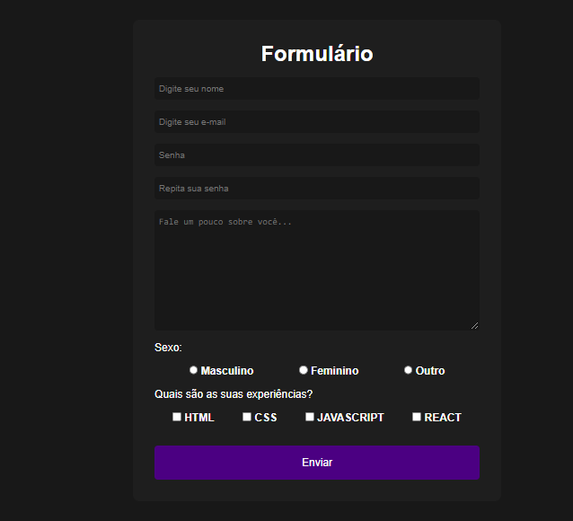

# FORMULARIO COM HTML, CSS E JS

Projeto desenvolvido com auxilio de um vídeo no Youtube com o professor Gustavo Neitzke.

Neste projeto foram utilizados as tecnologias:

* HTML
* CSS
* JAVASCRIPT

Segue link para o canal do Youtube: https://www.youtube.com/gustavoneitzke

